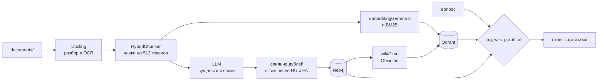
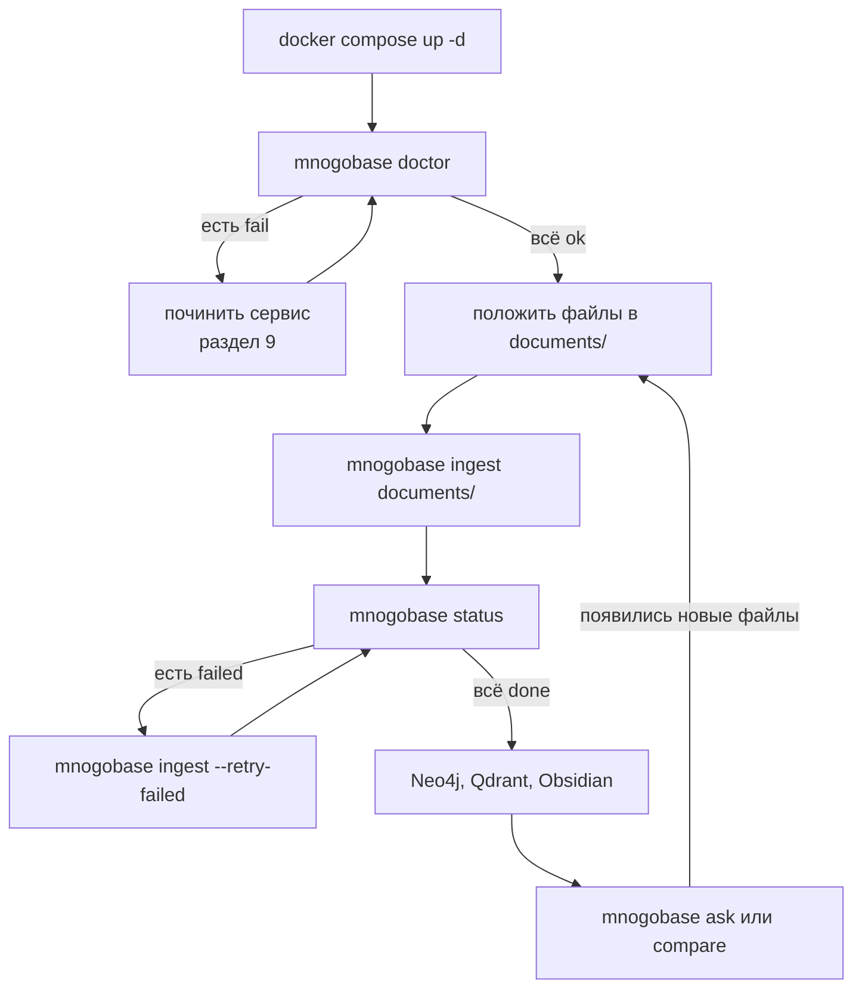
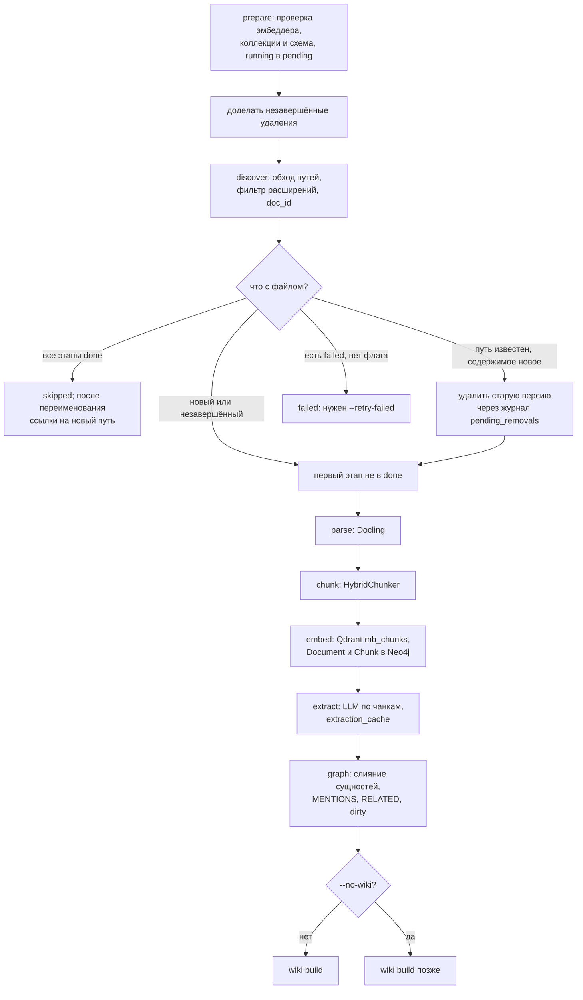
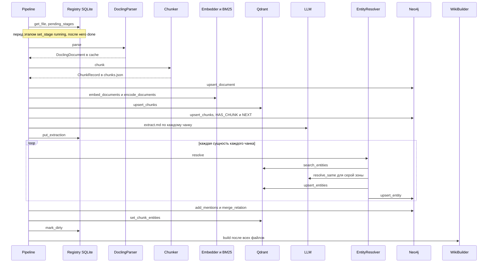
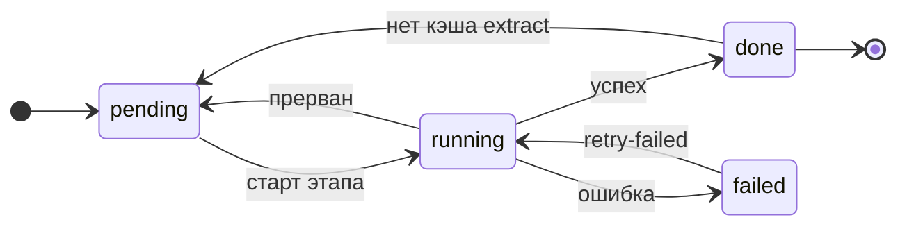
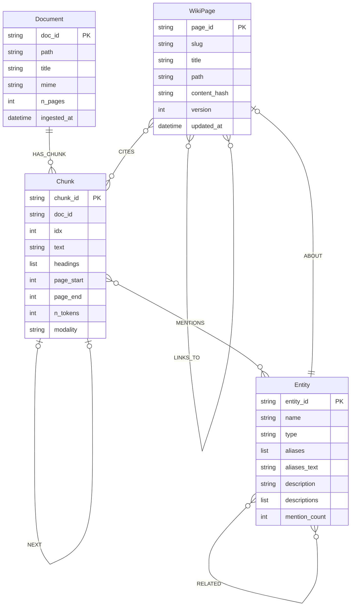
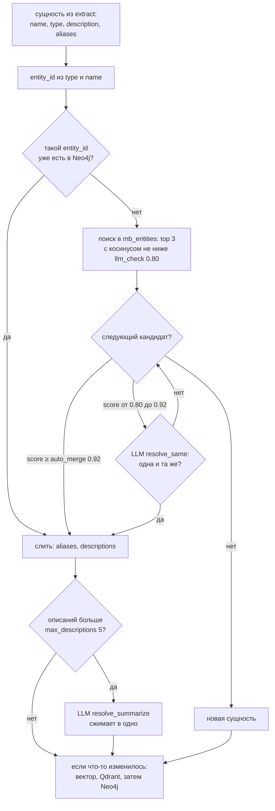
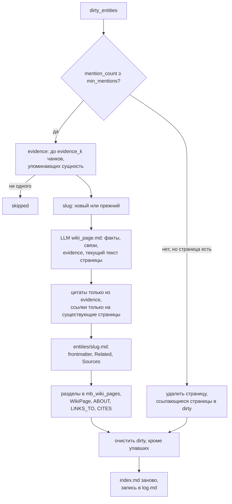
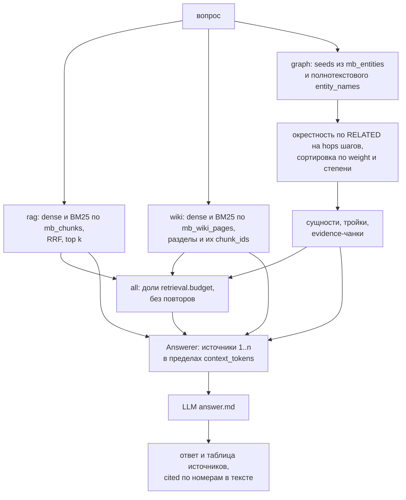
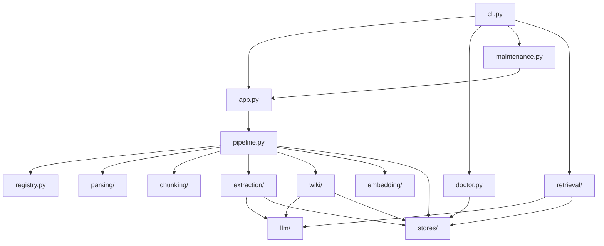

# mnogobase

Ядро проекта **LLM Wiki**: Python-пакет и CLI, который превращает папку документов на русском и английском в три связанных слоя знаний и отвечает по ним на вопросы со ссылками на источники.

## Содержание

1. [Что это такое](#1-что-это-такое)
2. [Установка и первый запуск](#2-установка-и-первый-запуск)
3. [Повседневная работа](#3-повседневная-работа): [документы](#31-куда-класть-документы), [ingest](#32-загрузка-документов-ingest), [wiki build](#33-сборка-wiki-wiki-build), [ask и compare](#34-вопросы-ask-и-compare), [status](#35-состояние-status), [reindex](#36-пересчёт-векторов-reindex), [reset](#37-полный-сброс-reset), [все команды](#38-все-команды)
4. [Как смотреть результаты](#4-как-смотреть-результаты): [Neo4j](#41-граф-в-neo4j), [Qdrant](#42-векторы-и-чанки-в-qdrant), [Obsidian](#43-wiki-в-obsidian), [compare.jsonl](#44-сравнение-режимов-runscomparejsonl), [логи](#45-логи-logsmnogobasejsonl)
5. [Как это устроено внутри](#5-как-это-устроено-внутри): [конвейер](#51-конвейер-ingest), [один файл](#52-загрузка-одного-файла), [состояния этапов](#53-состояния-этапов), [модель данных](#54-модель-данных), [слияние сущностей](#55-слияние-сущностей-entity-resolution), [wiki](#56-инкрементальное-обновление-wiki), [поиск](#57-поиск-и-ответ), [гарантии](#58-гарантии-согласованности)
6. [Справочник настроек](#6-справочник-настроек): [все ключи](#61-все-ключи-configyaml), [переменные окружения](#62-переопределение-через-переменные-окружения), [типы сущностей](#63-типы-сущностей)
7. [Как поменять типовые вещи](#7-как-поменять-типовые-вещи)
8. [Как расширять код](#8-как-расширять-код)
9. [Диагностика и частые проблемы](#9-диагностика-и-частые-проблемы)
10. [Тесты](#10-тесты)
11. [GPU и CUDA](#11-gpu-и-cuda)
12. [Структура репозитория](#12-структура-репозитория)
13. [Что дальше](#13-что-дальше)

---

## 1. Что это такое

`mnogobase` берёт документы (PDF, DOCX, PPTX, XLSX, HTML, Markdown, AsciiDoc, CSV, TXT) и строит из них:

- **векторный индекс** в Qdrant: плотные векторы EmbeddingGemma 2 (через Ollama) и разреженные BM25 для гибридного поиска;
- **граф знаний** в Neo4j: документы, чанки, сущности, связи между сущностями и чанки-доказательства для каждой связи;
- **wiki** из Markdown-страниц в духе LLM Wiki Карпаты: по странице на важную сущность, со сносками на источники. Wiki открывается в Obsidian и дописывается при каждом новом документе, а не переписывается с нуля.

По этим слоям можно задавать вопросы в четырёх режимах (`rag`, `wiki`, `graph`, `all`) и получать ответ с нумерованными цитатами: файл, страница, id чанка или раздела wiki. Команда `compare` отвечает во всех режимах сразу и сохраняет результаты для сравнения качества RAG, Wiki и Graph-RAG.

Общая схема: документы проходят разбор и чанкирование, затем расходятся в векторный индекс и в граф, из графа собирается wiki, а вопросы обслуживаются всеми тремя слоями.



**Ключевые решения**

| Вопрос | Решение | Почему |
|---|---|---|
| Векторная БД | Qdrant в Docker | именованные dense и sparse векторы в одной коллекции, встроенный hybrid-поиск (RRF), payload-фильтры, есть GPU-образ |
| Ключевые слова | BM25 как sparse-векторы в Qdrant (`fastembed`, `Qdrant/bm25`, IDF считает Qdrant) | не нужен отдельный Elasticsearch, слияние результатов на стороне БД |
| Граф | Neo4j 5 Community с APOC и GDS | Cypher и Neo4j Browser для исследования графа. APOC нужен только для запроса раскраски в разделе 4.1, GDS кодом пока не используется |
| Извлечение графа | свой конвейер, не LightRAG/Graphiti | полный контроль над чанками Docling, wiki и поиском; три подхода сравниваются на одних данных |
| Разбор и чанкинг | Docling `DocumentConverter` и `HybridChunker` | структурный и токен-осознанный чанкинг, много форматов, OCR |
| Эмбеддер | EmbeddingGemma 2 в Ollama (`embeddinggemma-2:740m`, 768 измерений) | мультиязычная модель, Matryoshka (768/512/256) |
| LLM | один клиент для любого OpenAI-совместимого API | Ollama, vLLM, LM Studio, OpenRouter, OpenAI и прокси подключаются правкой конфига. Структурированный вывод через строгую JSON Schema |
| Состояние | SQLite `.mnogobase/state.db` | файлы, этапы, ошибки, кэш извлечения, очередь wiki; на нём держатся возобновление и инкрементальность |
| Интерфейс | пакет и CLI на Typer | UI, API и MCP можно навесить поверх того же пакета |
| Язык wiki | английский по умолчанию | канонические английские имена сущностей склеивают русские и английские упоминания |
| Логи | structlog: консоль и JSONL-файл | формат готов для Loki/Grafana и трейсинга |

> **Конфиденциальность.** По умолчанию LLM — `gpt-6-luna` на `https://codex.sale/v1`, то есть **текст документов уходит на сторонний сервер** (извлечение, wiki, ответы). Для закрытых документов переключитесь на локальную модель Ollama (раздел [7.1](#71-llm-на-локальной-ollama)). Эмбеддинги всегда считаются локально.

---

## 2. Установка и первый запуск

### 2.1 Что нужно установить

| Что | Зачем | Проверка |
|---|---|---|
| [Docker Desktop](https://www.docker.com/products/docker-desktop/) | Qdrant и Neo4j | `docker info` |
| [Ollama](https://ollama.com) | эмбеддер EmbeddingGemma 2 (и, по желанию, локальная LLM) | `ollama --version` |
| [uv](https://docs.astral.sh/uv/) | Python 3.12 и зависимости | `uv --version` |
| [Obsidian](https://obsidian.md) (по желанию) | смотреть wiki и её граф | — |

### 2.2 Первый запуск (один раз)

Все команды выполняются **из корня репозитория**: оттуда читаются `config.yaml` и `.env`, и относительно текущей папки считаются пути `.mnogobase/`, `wiki/`, `logs/`, `runs/`.

```bash
# 1. Секреты
cp .env.example .env
#    откройте .env и впишите LLM_API_KEY=<ваш ключ>
#    NEO4J_PASSWORD оставьте mnogobase-dev (так же он задан в docker-compose.yml)

# 2. Базы данных: Qdrant (:6333) и Neo4j (:7474, :7687)
docker compose up -d

# 3. Модель эмбеддингов (~1.3 ГБ)
ollama pull embeddinggemma-2:740m

# 4. Python-зависимости (пакет ставится в .venv в режиме редактирования)
uv sync

# 5. Проверка: всё должно быть зелёным
uv run mnogobase doctor
```

> **Первый запуск `ingest` дольше обычного.** Docling скачивает свои модели разметки и OCR, чанкер — токенайзер `google/embeddinggemma-2` с Hugging Face, а BM25 — модель `Qdrant/bm25`. Если Hugging Face откажет в доступе (репозитории Gemma бывают закрыты), примите лицензию Gemma на странице модели и выполните `hf auth login` (или задайте `HF_TOKEN`).

### 2.3 Файл .env

`.env` читается из текущей папки при старте любой команды. Переменные, уже заданные в окружении, имеют приоритет над `.env`. **`.env` никогда не коммитится** (он в `.gitignore`).

| Переменная | Нужна | Что это |
|---|---|---|
| `LLM_API_KEY` | для внешнего LLM | ключ OpenAI-совместимого эндпоинта. Имя переменной задаётся в `llm.api_key_env`. Если переменная пуста, клиент отправляет заглушку `ollama` — локальной Ollama ключ не нужен |
| `NEO4J_PASSWORD` | да | пароль Neo4j. Имя переменной задаётся в `neo4j.password_env`. `docker-compose.yml` берёт этот же пароль при первом создании базы |
| `HF_TOKEN` | если Hugging Face требует авторизацию | токен для скачивания токенайзера |
| `MNOGOBASE_*` | по желанию | переопределение любого ключа `config.yaml` (раздел [6.2](#62-переопределение-через-переменные-окружения)) |

### 2.4 Проверка окружения (doctor)

`uv run mnogobase doctor` печатает таблицу проверок и завершается с кодом 1, если хоть одна проверка не прошла. Предупреждение (`warn`) ошибкой не считается.

| Проверка | Что делает | Типичный провал |
|---|---|---|
| `device` | выбирает устройство для Docling: CUDA → MPS → CPU (или то, что задано в `device`) | — |
| `ollama` | `GET {embedder.base_url}/api/tags`, ищет модель эмбеддера | `model embeddinggemma-2:740m missing: run ollama pull embeddinggemma-2:740m` |
| `llm` | `GET {llm.base_url}/models` с ключом; 404/405 считаются нормой (`models endpoint not available`) | 401/403 (неверный ключ), `<model> is not served by <base_url>` |
| `qdrant` | доступность и размерность коллекции `mb_chunks` | `mb_chunks has dim 768, config 512: run mnogobase reindex` (после смены `embedder.dim`) |
| `neo4j` | подключение с логином и паролем | `ServiceUnavailable`, `AuthError` |
| `index` | совпадает ли эмбеддер, которым построен индекс (модель, размерность, шаблоны), с текущим конфигом | `index was built with ..., config now uses ...: run mnogobase reindex` |
| `types` | менялись ли типы сущностей после загрузки документов | только `warn`, см. раздел [6.3](#63-типы-сущностей) |

Команды `ingest`, `wiki build`, `ask` и `compare` перед стартом сами выполняют облегчённую проверку (`ollama`, `llm`, `qdrant`, `neo4j`), `reindex` — без `llm` и без сверки размерности коллекций (он их пересоздаёт), `reset` — только `qdrant` и `neo4j`. Если сервис недоступен, команда печатает причину, советует `mnogobase doctor` и завершается с кодом 2.

---

## 3. Повседневная работа

Типичная сессия: поднять сервисы, проверить окружение, загрузить документы, проверить статус, посмотреть результаты и задавать вопросы; новые документы просто догружаются той же командой.



### 3.1 Куда класть документы

Кладите файлы в папку **`documents/`** в корне репозитория (она в `.gitignore`, в git ничего не попадёт):

```bash
mkdir -p documents
cp ~/Downloads/*.pdf documents/
```

- Подпапки можно любые: `ingest` обходит папку рекурсивно.
- Скрытые файлы и папки (имя начинается с `.`) пропускаются.
- Берутся только расширения из `parsing.extensions`: `pdf, docx, pptx, xlsx, html, htm, md, adoc, csv, txt`. Остальные файлы молча игнорируются.
- Документы могут быть на русском и на английском вперемешку. Страницы wiki пишутся на языке из `wiki.language` (по умолчанию `en`).

Папка может быть любой: `documents/` — просто соглашение. `ingest` принимает и отдельные файлы, и несколько путей сразу.

### 3.2 Загрузка документов (ingest)

```bash
uv run mnogobase ingest documents/
```

Для каждого файла по очереди выполняются этапы:

| Этап | Что происходит | Где результат |
|---|---|---|
| `parse` | Docling разбирает файл: текст, заголовки, таблицы, OCR для сканов; картинки сохраняются на будущее | `.mnogobase/cache/<doc_id>.json`, картинки и `images.json` в `.mnogobase/cache/<doc_id>/images/` |
| `chunk` | HybridChunker режет документ по структуре на чанки до `chunking.max_tokens` (512) токенов | `.mnogobase/cache/<doc_id>.chunks.json` |
| `embed` | каждый чанк (с заголовками раздела) → плотный вектор EmbeddingGemma 2 и BM25 | Qdrant `mb_chunks`; узлы `Document`, `Chunk`, связи `HAS_CHUNK`, `NEXT` в Neo4j |
| `extract` | LLM достаёт из каждого чанка сущности и связи (параллельно, до `llm.concurrency` запросов) | кэш в `.mnogobase/state.db` (`extraction_cache`) |
| `graph` | сущности сливаются с уже известными (в том числе RU и EN), связи пишутся в граф | Neo4j `Entity`, `MENTIONS`, `RELATED`; Qdrant `mb_entities`; `entity_ids` в payload чанков |
| wiki | после всех файлов: страницы сущностей с новыми упоминаниями создаются или дописываются | `wiki/entities/*.md`, `wiki/index.md`, `wiki/log.md`; Qdrant `mb_wiki_pages` |

Как это работает:

- **Инкрементально.** Документ опознаётся по хешу содержимого (`doc_id`). Повторный `ingest` той же папки пропускает неизменённые файлы. Изменённый файл сначала удаляет свою старую версию из Qdrant, Neo4j и wiki, затем загружается как новый — без дублей. Переименованный или перемещённый файл без изменений не загружается заново: ссылки в источниках переводятся на новый путь, а wiki-страницы, которые цитируют документ, показывают новое имя файла после ближайшей сборки wiki (`ingest` без `--no-wiki` или `wiki build`).
- **Возобновляемо.** Если процесс прервался (Ctrl+C, упал сервис), следующий `ingest` продолжит каждый файл с первого незавершённого этапа. Результаты LLM кэшируются, поэтому повторно оплачивать извлечение не нужно.
- **Ошибки изолированы.** Один сломанный файл не останавливает остальные. Внутри `extract` неудачные чанки допускаются, пока их доля не больше `extract.max_failed_ratio` (0.2). Упавший файл при следующих запусках пропускается с сообщением `stage <этап> failed earlier; rerun with --retry-failed`.

Варианты:

```bash
uv run mnogobase ingest documents/statya.pdf        # один файл
uv run mnogobase ingest documents/ --no-wiki        # без обновления wiki (быстрее; wiki можно собрать потом)
uv run mnogobase ingest --retry-failed              # перезапустить все упавшие файлы (пути берутся из state.db)
uv run mnogobase ingest documents/ --retry-failed   # перезапустить упавшие среди этих путей и догрузить новые
```

Пока `ingest` работает, в терминале обновляется прогресс:

```text
⠋ files                                   ━━━━━━━━━━━━━━━              4/12  0:21:40 3 processed · 1 skipped
⠋ Attention Is All You Need.pdf · extract ━━━━━━━━━━━━━━━━━━━━╸        43/96 0:03:12 2 failed
```

- верхняя строка — файлы: сколько готово из найденных (с разбивкой processed / skipped / failed) и сколько времени идёт прогон;
- нижняя — текущий файл и его этап (`parse`, `chunk`, `embed`, `extract`, `graph`). На `extract` видно, сколько чанков из общего числа уже извлечено (попадания в кэш тоже считаются, поэтому возобновлённый прогон проходит быстро) и сколько не удалось; на `graph` — сколько сущностей слито; `parse`, `chunk` и `embed` показывают только время;
- после всех файлов — шаги wiki: `wiki evidence` (поиск доказательств), `wiki draft` (LLM пишет страницы) и `wiki write` (запись страниц), каждый с числом страниц.

`wiki build` и `reindex` показывают такие же полосы для своих шагов. Когда команда заканчивается, полосы исчезают и печатается сводка; вне терминала (пайп, CI) прогресс не рисуется. Подробные времена каждого этапа — в `logs/mnogobase.jsonl` (раздел [4.5](#45-логи-logsmnogobasejsonl)). Служебные сообщения библиотек (INFO от RapidOCR, полосы загрузки моделей Hugging Face) скрыты, предупреждения и ошибки печатаются как раньше.

В конце печатается сводка `run <run_id>: processed N, skipped N, failed N`, отчёт wiki и список упавших файлов с причиной. Код выхода 1, если упал хоть один файл или хоть одна wiki-страница.

> Отдельной команды «только чанкирование» нет: чанки получаются на этапе `chunk` внутри `ingest`. Посмотреть их можно в `.mnogobase/cache/<doc_id>.chunks.json`, в Qdrant (раздел 4.2) или в Neo4j (раздел 4.1).

### 3.3 Сборка wiki (wiki build)

```bash
uv run mnogobase wiki build         # обновить страницы сущностей с новыми упоминаниями
uv run mnogobase wiki build --all   # перегенерировать все страницы (например, после смены языка или промпта)
```

`ingest` без `--no-wiki` сам вызывает сборку wiki в конце. Отдельно `wiki build` нужен после `ingest --no-wiki`, после изменения настроек `wiki.*` или промпта `wiki_page.md`, а также для повтора упавших страниц (они остаются в очереди). Печатается отчёт `wiki: created N, updated N, deleted N, skipped N, failed N`; код выхода 1, если какая-то страница не собралась.

### 3.4 Вопросы (ask и compare)

```bash
uv run mnogobase ask "Что такое механизм внимания?"               # режим all (по умолчанию)
uv run mnogobase ask "Что такое механизм внимания?" --mode graph  # или -m rag | wiki | graph | all
uv run mnogobase ask "Что такое механизм внимания?" --k 12        # больше результатов на каждый поиск
uv run mnogobase compare "Что такое механизм внимания?"           # все 4 режима рядом
```

| Режим | Откуда берётся контекст |
|---|---|
| `rag` | ближайшие чанки из Qdrant `mb_chunks` (гибридный поиск dense + BM25, слияние RRF) |
| `wiki` | разделы wiki-страниц из `mb_wiki_pages` (тот же гибридный поиск) и чанки, на которые эти разделы ссылаются |
| `graph` | сущности, найденные по вопросу, их окрестность в графе на `graph.hops` шага и чанки-доказательства сильнейших связей |
| `all` | всё вместе: каждый режим получает долю общего бюджета токенов (`retrieval.budget`), повторы убираются |

Ответ печатается в рамке с режимом и временем, под ним — таблица источников: номер `[n]`, отметка `cited` (LLM сослалась на этот номер в тексте), вид (`chunk`, `wiki`, `entity`, `relation`), файл и страница, `ref` (id чанка, раздела wiki или связи) и начало текста. LLM отвечает на языке вопроса; если источников нет, печатается `The knowledge base has no relevant sources for this question.`

`compare` печатает таблицу: режим, ответ, процитированные источники, задержка, токены LLM, размер контекста, и дописывает по строке на режим в `runs/compare.jsonl` (раздел 4.4).

`ask` и `compare` работают только внутри проекта (нужен `.mnogobase/state.db`), иначе завершаются с кодом 2 и ничего не создают. Блокировку `ingest` они не берут: спрашивать можно и во время загрузки.

### 3.5 Состояние (status)

```bash
uv run mnogobase status
```

Показывает: файлы по статусам (`done`, `failed`, `processing`, `pending`), таблицу этапов (`done / failed / pending / running`), число сущностей в очереди на обновление wiki, незавершённые удаления старых версий документов, предупреждение о смене типов сущностей и таблицу ошибок (`doc_id`, этап, текст ошибки). Вне проекта сообщает, что проекта нет, и завершается с кодом 0, ничего не создавая.

### 3.6 Пересчёт векторов (reindex)

```bash
uv run mnogobase reindex
```

Нужен после смены эмбеддера (модель, размерность, шаблоны): `ingest`, `wiki build`, `ask` и `compare` сами замечают такую смену и останавливаются с просьбой запустить `reindex`. Сначала проверяет, что эмбеддер выдаёт вектор размерности `embedder.dim` (иначе останавливается, ничего не тронув), затем удаляет и заново создаёт три коллекции Qdrant с новой размерностью и пересчитывает векторы: чанки — из кэша `.mnogobase/cache/<doc_id>.chunks.json` (если кэша нет, текст берётся из Neo4j), сущности — из Neo4j, разделы wiki — из файлов `wiki/entities/*.md`. Граф, wiki-файлы и кэш извлечения не меняются, LLM не вызывается. Печатает `reindexed: N chunks, N entities, N wiki sections`.

Пока `reindex` идёт, индекс помечен как незавершённый: если его прервать, `ingest` и `ask` откажутся работать, пока `reindex` не будет запущен снова и не дойдёт до конца. Пример смены модели и размерности — рецепт [7.4](#74-сменить-эмбеддер-или-размерность).

### 3.7 Полный сброс (reset)

```bash
uv run mnogobase reset            # покажет, что удалит, и спросит подтверждение
uv run mnogobase reset --yes      # без вопроса
```

`reset` безопасен:

- вне проекта (нет `.mnogobase/state.db`) он отказывается работать даже с `--yes` (код 2): неверная папка или `--config` не должны стереть чужие данные;
- перед подтверждением показывает, что именно удалит: **все узлы в базе Neo4j по умолчанию** (держите отдельный Neo4j на проект), коллекции Qdrant с префиксом `mb_`, состояние и кэши в `.mnogobase/` (таблицы очищаются, сам `state.db` остаётся, папка `cache/` удаляется), а из wiki — только то, что создал сам: `entities/`, `index.md`, `log.md`. Другие файлы в `wiki/` (например, ваши заметки) не трогаются, папка удаляется, только если опустела.

Отказ на вопросе подтверждения завершает команду с кодом 1.

### 3.8 Все команды

Глобальная опция `--config/-c PATH` ставится **перед** командой: `uv run mnogobase -c other.yaml status`. Без неё используется путь из `$MNOGOBASE_CONFIG` или `./config.yaml`; если файла `./config.yaml` нет, берутся значения по умолчанию из кода.

| Команда | Что делает | Проверка сервисов | Блокировка |
|---|---|---|---|
| `doctor` | все проверки окружения (раздел 2.4) | — | нет |
| `status` | сводка по файлам, этапам, очереди wiki, удалениям и ошибкам | — | нет |
| `ingest PATH... [--no-wiki] [--retry-failed]` | загрузка документов | ollama, llm, qdrant, neo4j | да |
| `wiki build [--all]` | обновить страницы сущностей с новыми упоминаниями (или все) | ollama, llm, qdrant, neo4j | да |
| `ask "ВОПРОС" [--mode/-m rag\|wiki\|graph\|all] [--k N]` | ответ с цитатами в одном режиме | ollama, llm, qdrant, neo4j | нет |
| `compare "ВОПРОС" [--k N]` | все 4 режима рядом и запись в `runs/compare.jsonl` | ollama, llm, qdrant, neo4j | нет |
| `reindex` | пересчитать все векторы после смены эмбеддера | ollama, qdrant, neo4j | да |
| `reset [--yes]` | удалить все данные проекта | qdrant, neo4j | да |

Одновременно может работать только одна из команд `ingest` / `wiki build` / `reindex` / `reset` (файловая блокировка `.mnogobase/ingest.lock`). Вторая сразу завершается с сообщением `Another ingest / wiki / reindex / reset run is in progress.`

**Коды выхода:**

| Код | Когда |
|---|---|
| 0 | успех; `status` вне проекта |
| 1 | `doctor` нашёл проблему; в `ingest` упал файл или wiki-страница; в `wiki build` упала страница; отказ в подтверждении `reset` |
| 2 | ошибка конфига; сервис недоступен на предварительной проверке; блокировка занята; нет проекта (`ask`, `compare`, `reset`); индекс построен другим эмбеддером, другой размерности или с другими шаблонами; `reindex`: эмбеддер выдаёт не ту размерность; не удаётся завершить удаление старой версии документа |

---

## 4. Как смотреть результаты

### 4.1 Граф в Neo4j

1. Откройте **http://localhost:7474**.
2. Подключение: `neo4j://localhost:7687`, пользователь `neo4j`, пароль из `.env` (по умолчанию `mnogobase-dev`).
3. **Стиль (один раз).** Выполните в строке запроса `:style`, затем перетащите в открывшуюся панель файл [`docs/neo4j/mnogobase.grass`](docs/neo4j/mnogobase.grass). У сущностей появятся имена, у связей — предикаты, у документов и чанков — свои цвета и подписи (заголовок документа, номер чанка).
4. **Цвет по типу сущности (по желанию).** Тип хранится в свойстве `type`; чтобы раскрасить узлы, добавьте его как метку (стиль выше уже содержит цвета для всех 20 типов по умолчанию, см. раздел 6.3):

   ```cypher
   MATCH (e:Entity) CALL apoc.create.addLabels(e, [e.type]) YIELD node RETURN count(node);
   ```

   Повторяйте после новых `ingest`. mnogobase эти метки не использует и не мешает им.

Готовые запросы (вставлять в строку запроса Neo4j Browser):

```cypher
// Весь граф знаний: сущности и связи между ними (самые сильные связи)
MATCH (a:Entity)-[r:RELATED]->(b:Entity)
RETURN a, r, b ORDER BY r.weight DESC LIMIT 300;
```

```cypher
// Окрестность одной сущности на 2 шага (замените имя)
MATCH (e:Entity) WHERE toLower(e.name) CONTAINS 'transformer'
MATCH p = (e)-[:RELATED*1..2]-(:Entity)
RETURN p LIMIT 150;
```

```cypher
// Самые упоминаемые сущности
MATCH (e:Entity)
RETURN e.name AS name, e.type AS type, e.mention_count AS mentions, e.aliases AS aliases
ORDER BY mentions DESC LIMIT 30;
```

```cypher
// Документ → его чанки → сущности, которые в них упоминаются
MATCH (d:Document)-[:HAS_CHUNK]->(c:Chunk)-[:MENTIONS]->(e:Entity)
WHERE d.path CONTAINS 'statya'          // часть имени файла
RETURN d, c, e LIMIT 200;
```

```cypher
// Чанки одного документа по порядку (как его порезал чанкер)
MATCH (d:Document)-[:HAS_CHUNK]->(c:Chunk)
WHERE d.path CONTAINS 'statya'
RETURN c.idx AS idx, c.headings AS headings, c.n_tokens AS tokens, left(c.text, 200) AS text
ORDER BY idx;
```

```cypher
// Откуда взят факт: связь и тексты чанков-доказательств
MATCH (a:Entity)-[r:RELATED]->(b:Entity)
WHERE toLower(a.name) CONTAINS 'transformer'
UNWIND r.evidence AS cid
MATCH (c:Chunk {chunk_id: cid})<-[:HAS_CHUNK]-(d:Document)
RETURN a.name, r.predicate, b.name, d.path, c.page_start, left(c.text, 200) LIMIT 50;
```

```cypher
// Wiki-страницы и ссылки между ними
MATCH (p:WikiPage)-[l:LINKS_TO]->(q:WikiPage) RETURN p, l, q LIMIT 200;
```

```cypher
// Сущности, которые слились из русских и английских упоминаний (есть кириллические алиасы)
MATCH (e:Entity) WHERE any(a IN e.aliases WHERE a =~ '.*[а-яА-ЯёЁ].*')
RETURN e.name, e.type, e.aliases ORDER BY e.mention_count DESC LIMIT 50;
```

Полная схема графа — в разделе [5.4](#54-модель-данных).

### 4.2 Векторы и чанки в Qdrant

Откройте **http://localhost:6333/dashboard** → **Collections**:

| Коллекция | Что в ней | Payload |
|---|---|---|
| `mb_chunks` | чанки документов | `chunk_id`, `doc_id`, `text`, `headings`, `page`, `path`, `modality`, `entity_ids` |
| `mb_entities` | сущности (для слияния дублей и поиска сущностей по вопросу) | `entity_id`, `name`, `type` |
| `mb_wiki_pages` | разделы wiki-страниц (по точке на раздел `##`) | `key`, `page_id`, `entity_id`, `path`, `section`, `text`, `chunk_ids` |

В коллекции есть вкладка **Points** (содержимое и payload) и **Visualize** (2D-проекция векторов: видно, как чанки группируются по темам). Фильтр по документу в Points: `doc_id` = нужный `doc_id`.

### 4.3 Wiki в Obsidian

1. В Obsidian: **Open folder as vault** → выберите папку **`wiki/`** в корне репозитория. Она появится после первого `ingest` (или `wiki build`).
2. Начните с **`index.md`**: это оглавление всех страниц, сгруппированное по типам сущностей. В **`log.md`** — журнал прогонов: время, `run_id`, обработанные документы и какие страницы созданы, обновлены или удалены.
3. Страницы сущностей лежат в `entities/<slug>.md`. Каждая страница содержит:
   - свойства (frontmatter): `id` (это `entity_id`), `type`, `aliases`, `sources` (число разных файлов-источников), `updated`, `version`. `aliases` Obsidian использует при поиске и в подсказках ссылок, поэтому русские и английские названия находят одну страницу;
   - текст со сносками `[^chunk_id]`: каждое утверждение ссылается на чанк-источник, а внизу в разделе **Sources** указаны файл и страница;
   - раздел **Related**: связи из графа (`predicate → [[slug|Имя]]` для исходящих, `←` для входящих). Ссылкой связь становится, только если у соседа есть страница.
4. **Граф:** `Cmd/Ctrl+G` открывает общий граф, «Open local graph» в меню страницы — окрестность текущей страницы.
5. **Раскраска по типам:** в настройках графа → **Groups** → «New group» и запрос по свойству, например:
   - `[type:Person]` — люди,
   - `[type:Concept]` — понятия,
   - `[type:Method]` — методы,
   - `[type:Technology]` — технологии.

   Чтобы скрыть служебные страницы, в **Filters** укажите `-file:index -file:log`.

Что важно знать:

- **Не редактируйте `entities/*.md` вручную:** при следующем обновлении страницы LLM перепишет её на основе прежнего текста и новых фактов, ручные правки могут потеряться. Свои заметки кладите рядом, например в `wiki/notes/`. Их не трогает ни `wiki build`, ни `reset`. В заметках можно ссылаться на страницы сущностей: `[[transformer]]`.
- Страница создаётся для сущностей, которые упомянуты не менее чем в `wiki.min_mentions` чанках (по умолчанию 2) и для которых нашлись чанки-доказательства.
- Папка `wiki/` в `.gitignore` (это производные данные). Если команде нужно хранить wiki в git, уберите её оттуда.

### 4.4 Сравнение режимов (runs/compare.jsonl)

Каждый `compare` дописывает 4 строки JSON (по одной на режим) с полями:

| Поле | Что это |
|---|---|
| `ts` | время прогона (UTC, одинаковое для 4 строк) |
| `question`, `mode`, `answer` | вопрос, режим, текст ответа |
| `sources` | список источников: `n`, `kind`, `ref`, `path`, `page`, `snippet`, `cited` |
| `latency_ms` | поиск и генерация вместе |
| `tokens_in`, `tokens_out` | токены LLM на ответ (по данным `usage` эндпоинта) |
| `context_tokens` | оценка размера контекста (символы / 4) |
| `config_hash` | хеш настроек `llm`, `embedder`, `chunking`, `retrieval`, `graph`: сравнивайте прогоны только с одинаковым хешем |

Примеры с `jq`:

```bash
# режим, задержка, токены и число процитированных источников
jq -r '[.mode, .latency_ms, .tokens_in, .tokens_out, ([.sources[] | select(.cited)] | length)] | @tsv' runs/compare.jsonl

# все ответы на конкретный вопрос
jq 'select(.question | test("внимани")) | {mode, answer}' runs/compare.jsonl
```

### 4.5 Логи (logs/mnogobase.jsonl)

Команды пишут структурированный лог в `logs/mnogobase.jsonl` (JSON по строкам, ротация по 10 МБ, хранится 5 старых файлов). В консоль выводятся только предупреждения и ошибки. Трейсбеки пишутся без локальных переменных, чтобы в лог не попадали ключи и тексты документов.

Общие поля: `ts`, `level`, `event`, `run_id` (у `ingest` и `wiki build`), `doc_id` (внутри обработки файла). Основные события:

| `event` | Поля | Когда |
|---|---|---|
| `stage_done` / `stage_failed` | `stage`, `duration_ms`, `path`; при ошибке `error_type`, `error`, `exception` | каждый этап каждого файла |
| `parsed` | `title`, `n_pages`, `n_images` | после Docling |
| `llm_call` | `task` (`extract`, `resolve`, `wiki`, `answer`), `model`, `tokens_in`, `tokens_out`, `retries`, `duration_ms` | каждый вызов LLM |
| `llm_invalid_json` | `task`, `error` | ответ LLM не прошёл схему, идёт повтор с текстом ошибки |
| `extract_failed` / `extract_partial` | `chunk_id`, `error` / `failed`, `total` | неудачные чанки на этапе `extract` |
| `entity_merged` | `name`, `into`, `score`, `method` (`vector` или `llm`) | слияние сущностей |
| `wiki_built` / `wiki_page_failed` | счётчики / `entity_id`, `error` | сборка wiki |
| `ingest_done`, `ingest_file_failed` | счётчики / `path`, `error` | итог `ingest` |
| `resuming_interrupted_stages`, `resuming_document_removal`, `document_removed`, `document_repointed`, `document_needs_reingest` | | восстановление, удаление старых версий, переименование |
| `entity_types_changed` | `detail` | типы сущностей поменялись |
| `reindex_done`, `reset_done` | счётчики | обслуживание |
| `embedder_signature_upgraded` | `old`, `new` | старая подпись индекса `model_id:dim` переписана в формате с хешем шаблонов |

Примеры с `jq`:

```bash
# сколько секунд занял каждый этап в сумме
jq -s 'map(select(.event=="stage_done")) | group_by(.stage)
       | map({stage: .[0].stage, seconds: ((map(.duration_ms) | add) / 1000)})' logs/mnogobase.jsonl

# все ошибки
jq 'select(.level=="error") | {ts, event, doc_id, stage, error_type, error}' logs/mnogobase.jsonl

# вызовы и токены LLM по задачам
jq -s 'map(select(.event=="llm_call")) | group_by(.task)
       | map({task: .[0].task, calls: length, tokens_in: (map(.tokens_in) | add), tokens_out: (map(.tokens_out) | add)})' logs/mnogobase.jsonl

# какие сущности слились и как
jq -c 'select(.event=="entity_merged") | {name, into, score, method}' logs/mnogobase.jsonl

# один прогон (run_id печатается в конце ingest)
jq -c 'select(.run_id=="<run_id>")' logs/mnogobase.jsonl
```

---

## 5. Как это устроено внутри

### 5.1 Конвейер ingest

Схема показывает путь каждого файла через этапы: подготовка, обнаружение, при необходимости удаление старой версии, пять этапов и сборка wiki.



Детали этапов:

- **parse** — `DocumentConverter` с OCR из `parsing.ocr` и ускорителем из `device` (эти опции заданы для PDF; на CUDA увеличены размеры батчей). Заголовок документа — первый элемент Docling с меткой `TITLE`, иначе имя файла.
- **chunk** — `HybridChunker(merge_peers=True)` с HF-токенайзером из `chunking.tokenizer` и пределом `chunking.max_tokens`. Для эмбеддинга используется `contextualize(chunk)` (заголовки раздела и текст), в payload и граф кладётся чистый текст, заголовки и страницы. Пустые чанки отбрасываются.
- **embed** — плотные векторы батчами по `embedder.batch_size` через `POST /api/embed` Ollama (с `truncate: true`), обрезка до `embedder.dim` и нормировка; BM25 через fastembed. Шаблон документа: `title: {title} | text: {text}`.
- **extract** — для каждого чанка промпт `extract.md` и строгая JSON Schema `{entities: [{name, type, description, aliases}], relations: [{source, target, predicate, description, strength}]}`. Ответ чистится: неизвестный тип → `Other`, дубли имён сливаются, предикат → `snake_case`, `strength` ограничивается 1–10, связи с неизвестными концами отбрасываются. Результат кэшируется по `(chunk_id, prompt_version, model)`.
- **graph** — по каждому чанку: слияние каждой сущности (раздел 5.5), `MENTIONS` от чанка к сущностям, `entity_ids` в payload чанка, `RELATED` по `(src, dst, predicate)` с дописыванием `evidence` и `weight += strength`. Все затронутые сущности попадают в `dirty_entities`. Если у документа больше `max_failed_ratio` чанков без кэша извлечения, `graph` падает, а `extract` возвращается в `pending`.

### 5.2 Загрузка одного файла

Диаграмма последовательности показывает, кто с кем общается при загрузке одного нового файла.



### 5.3 Состояния этапов

Каждый этап каждого документа хранится в таблице `stages` со статусом; диаграмма показывает переходы, включая возобновление после прерывания и повтор упавших.



- Статуса нет в таблице → этап считается `pending`. Документ без незавершённых этапов пропускается (`skipped`).
- Этап в `running` при старте следующего `ingest` значит, что процесс прервали: он сбрасывается в `pending` (событие `resuming_interrupted_stages`), и работа продолжается с него.
- `failed` без `--retry-failed` не перезапускается: файл помечается `failed` с подсказкой. С флагом документ продолжается с первого не-`done` этапа; на `extract` повторно вызываются только чанки без кэша.
- Статус файла (`files.status`): `processing` во время работы, затем `done` или `failed`; `pending` — если файл нужно загрузить заново после удаления общей с ним старой версии.

### 5.4 Модель данных

**Neo4j.** Узлы и связи с ключевыми свойствами:



- `RELATED` — один тип связи, смысл в свойствах: `predicate` (snake_case), `description` (самое длинное из описаний), `weight` (сумма `strengths`), `evidence` (список `chunk_id`), `strengths` (сила из каждого чанка, параллельно `evidence`).
- `Entity.mention_count` — число чанков с `MENTIONS` на сущность; `descriptions` — накопленные описания, `description` — их склейка; `aliases_text` — алиасы через ` | ` для полнотекстового индекса.
- `WikiPage.page_id` равен `entity_id`, `path` — путь относительно `wiki/` (`entities/<slug>.md`).
- Ограничения уникальности: `Document.doc_id`, `Chunk.chunk_id`, `Entity.entity_id`, `WikiPage.page_id`. Индексы: `WikiPage.slug`, `Chunk.doc_id`, полнотекстовый `entity_names` по `Entity.name` и `Entity.aliases_text`. Схема создаётся `IF NOT EXISTS` при каждом запуске (`GraphStore.ensure_schema`).

**Qdrant.** Префикс коллекций — `qdrant.prefix` (`mb_`). Плотный вектор называется `dense` (косинус, размерность `embedder.dim`), разреженный — `bm25` (модификатор IDF). Все индексируемые поля payload — keyword.

| Коллекция | Векторы | Индексы payload | Что эмбеддится | ID точки |
|---|---|---|---|---|
| `mb_chunks` | `dense`, `bm25` | `chunk_id`, `doc_id`, `entity_ids`, `modality` | заголовки раздела и текст чанка | `uuid5(chunk_id)` |
| `mb_entities` | `dense` | `entity_id`, `type` | `"{name}: {description}"` | `uuid5(entity_id)` |
| `mb_wiki_pages` | `dense`, `bm25` | `page_id`, `entity_id` | раздел страницы без сносок, с заголовком `Название — Раздел` | `uuid5("{page_id}#{номер раздела}")` |

**Детерминированные ID** (`src/mnogobase/ids.py`) — на них держатся идемпотентность и дедупликация:

| Объект | ID |
|---|---|
| Документ | `doc_id = sha256(байты файла)[:16]` — одинаковое содержимое по разным путям даёт один документ |
| Чанк | `chunk_id = f"{doc_id}:{idx:05d}"` |
| Сущность | `entity_id = sha1(f"{type.casefold()}\|{normalize_name(name)}")[:16]`; `normalize_name`: NFKC, casefold, все разделители кроме `+` и `#` → пробел, пробелы схлопываются |
| Wiki-страница | `page_id = entity_id`; `slug` = нормализованное имя через дефис (`#` → `sharp`, длинные имена обрезаются с хешем), при занятости `slug-<тип>`, затем `slug-<6 символов id>` |
| Точка Qdrant | `uuid5(NAMESPACE, ключ)`, ключ — `chunk_id`, `entity_id` или `page_id#i` |

**SQLite registry** (`.mnogobase/state.db`):

| Таблица | Колонки | Зачем |
|---|---|---|
| `files` | `path` PK, `doc_id`, `size`, `mtime`, `status`, `updated_at` | какие пути загружены и с каким содержимым |
| `stages` | `doc_id`, `stage`, `status`, `attempts`, `error`, `updated_at` | состояние этапов `parse`, `chunk`, `embed`, `extract`, `graph` |
| `chunk_extract` | `chunk_id` PK, `status`, `attempts`, `error` | результат извлечения по чанкам |
| `extraction_cache` | `chunk_id`, `prompt_version`, `model`, `result_json` | кэш ответов LLM на этапе `extract` |
| `dirty_entities` | `entity_id` PK, `marked_at` | очередь сущностей на обновление wiki |
| `meta` | `key` PK, `value` | подпись эмбеддера индекса (`embedder` = `ollama:<model>:<dim>:tpl-<хеш шаблонов>`) и служебные значения |
| `pending_removals` | `doc_id` PK, `plan_json` | журнал незавершённых удалений старых версий документов |

### 5.5 Слияние сущностей (entity resolution)

Каждая извлечённая сущность либо совпадает с уже известной, либо сливается с похожей, либо создаётся заново:



- Имена извлекаются как канонические английские, исходное написание уходит в `aliases` — поэтому русский и английский тексты обычно дают один `entity_id` сразу, а вектор и LLM ловят остальные случаи (синонимы, сокращения, варианты написания).
- При слиянии сохраняются имя и тип существующей сущности, новое имя становится алиасом. Сопоставление `entity_id` извлечённой сущности с итоговым запоминается на время процесса, чтобы не искать заново.
- Поиск по вектору идёт без фильтра по типу.

### 5.6 Инкрементальное обновление wiki

Сборка wiki обрабатывает только сущности из очереди `dirty_entities` (или все при `--all`):



- **Evidence** — чанки, где упомянута сущность (фильтр `entity_ids` в `mb_chunks`), ранжированные по близости к вектору `"{name}: {description}"`, не больше `wiki.evidence_k` (12). При обновлении к ним добавляются чанки, которые уже цитирует текущая страница, если они существуют и всё ещё упоминают сущность: валидные цитаты не теряются, когда чанк выпал из свежего top-K.
- **Обновление, а не переписывание.** LLM получает текущий текст страницы и правило «сохранить подтверждённое, добавить новое, исправить противоречия».
- **Валидация.** Сноски `[^id]` на чанки вне evidence удаляются. `[[Name]]` превращается в `[[slug|Name]]`, только если у Name (по имени или алиасу) есть страница или она пишется в этом же прогоне, иначе остаётся текстом. Разделы `## Related` и `## Sources`, заголовок и определения сносок генерируются кодом, а не LLM.
- **Надёжность.** Ошибка одной страницы не валит сборку: сущность остаётся в очереди и повторяется в следующий раз. `index.md` пересобирается целиком, в `log.md` дописывается запись, если что-то изменилось или были обработаны документы.

### 5.7 Поиск и ответ

Четыре режима собирают контекст по-разному, а ответ формирует общий `Answerer`:



- **rag** — гибридный запрос Qdrant: два prefetch по `k * 4` (`dense` и `bm25`), слияние RRF, `k` результатов.
- **wiki** — то же по разделам wiki; после каждого раздела идут чанки из его `chunk_ids` (всего не больше `k`), чтобы ответ ссылался на файл и страницу.
- **graph** — seeds: до `graph.seeds` сущностей по вектору вопроса с косинусом не ниже `graph.seed_threshold` плюс полнотекстовый поиск по именам и алиасам (всего не больше `2 * seeds`). Окрестность на `graph.hops` шагов (в коде ограничено 1–3), до `graph.max_relations` связей; контекст — описания seed-сущностей, тройки `A —predicate→ B` и до `k` чанков-доказательств.
- **all** — режимы по очереди заполняют свою долю `retrieval.context_tokens` (`retrieval.budget`), повторы по `(kind, ref)` пропускаются.
- **Answerer** нумерует элементы `[1]..[n]`, пока не исчерпан `retrieval.context_tokens` (первый элемент берётся всегда; токены оцениваются как символы / 4), отправляет промпт `answer.md` и отмечает `cited` у источников, номера которых встречаются в ответе.

### 5.8 Гарантии согласованности

- **Идемпотентность.** Все записи — upsert/`MERGE` по детерминированным ID, поэтому повтор этапа после падения даёт тот же результат. `merge_relation` не добавляет `evidence` из того же чанка дважды (вес не удваивается), `mention_count` пересчитывается подсчётом связей.
- **Порядок записи.** Этап отмечается `done` только после всех записей. На `embed`: узел `Document` → точки Qdrant → узлы `Chunk`. При слиянии сущности: вектор → Qdrant → Neo4j, чтобы сбой эмбеддера или Qdrant не оставил граф «впереди».
- **Изменённый файл.** План удаления старой версии вычисляется только чтением и записывается в журнал `pending_removals`. Затем: одна транзакция Neo4j (чанки, документ, `evidence` из его чанков, связи без `evidence`, сущности без упоминаний и их страницы) → очередь wiki → Qdrant и файлы wiki → registry → запись журнала удаляется последней. Граф чистится первым намеренно: если шаг Qdrant не удался, режимы `rag`/`wiki`/`all` до следующего `ingest` или `wiki build` (они доводят журнал) могут вернуть текст удалённой версии, режим `graph` уже чист. Незавершённое удаление перепроверяется по графу, а если довести его не удаётся, `ingest` и `wiki build` завершаются с кодом 2.
- **Одинаковое содержимое по двум путям** — один документ. Второй путь пропускается; изменение одного из файлов не удаляет данные, пока другой путь хранит то же содержимое (ссылки в источниках переводятся на живой путь). Живой путь — тот, где файл существует и его хеш совпадает с `doc_id`: строка registry для переименованного или удалённого файла копией не считается.
- **Переименование.** Файл с новым путём и прежним содержимым пропускается, а если записанный путь документа (кэш чанков или `Document.path` в Neo4j; кэша может не быть) больше не хранит это содержимое, документ переводится на новый путь: сначала `path` в payload чанков Qdrant, затем `Document.path`, кэш чанков последним, поэтому прерванный перевод доделывает следующий `ingest`. Wiki-страницы, которые цитируют чанки документа, помечаются на обновление: раздел `## Sources` получит новое имя файла при ближайшей сборке wiki. Строки registry с этим содержимым, файла которых больше нет, удаляются, а строки существующих файлов (копий или изменённых) остаются. Если после этого `ingest` изменить переименованный файл, старая версия удаляется как обычно. Переименование и правка между двумя запусками `ingest` выглядят как удалённый старый файл плюс новый: старая версия остаётся (см. ограничения).
- **Блокировка.** Файловая блокировка `.mnogobase/ingest.lock` не даёт параллельно запускать пишущие команды; блокировка снимается автоматически при завершении процесса.
- **Повторы сетевых вызовов.** LLM: до 5 попыток при ошибках соединения и таймаутах, 429 и 5xx (экспоненциальная пауза до 30 с); невалидный JSON — ещё до 2 попыток с текстом ошибки валидации. Ollama: до 5 попыток при сетевых ошибках и 5xx. Qdrant: до 5 попыток при сетевых ошибках. Neo4j — средствами драйвера.
- **Подпись эмбеддера.** В `meta` хранится `model_id:dim:tpl-<хеш>`, где хеш (8 hex-символов sha256) покрывает `embedder.doc_template` и `query_template`. Смена модели, размерности или любого из шаблонов останавливает `ingest`, `wiki build`, `ask` и `compare` до `reindex`. Старая подпись без хеша (`model_id:dim`) принимается, если модель и размерность совпадают, и переписывается в новом формате при следующем запуске (только если значение в `meta` не изменилось за это время: идущий параллельно `reindex` не затирается). Такая подпись не знает, какими шаблонами построен индекс: если вы меняли `doc_template`/`query_template` до этой версии и не запускали после этого `reindex`, выполните `uv run mnogobase reindex` один раз.
- **Ограничения.** Удалённые с диска файлы из индекса не убираются (строки registry для них остаются, если то же содержимое не нашлось по другому пути). Также остаётся старая версия файла, который переименовали и изменили без `ingest` между этими шагами.

---

## 6. Справочник настроек

Все несекретные параметры — в `config.yaml`, секреты — в `.env`. Описание всех полей с типами — в `src/mnogobase/config.py`; значения по умолчанию в коде совпадают с `config.yaml`.

Приоритет источников: переменные `MNOGOBASE_*` (в том числе из `.env`) → файл конфига → значения по умолчанию. Ошибка в конфиге (неверный YAML, неизвестное значение, некорректный тип сущности) останавливает любую команду с `Invalid configuration: ...` и кодом 2; явно указанный, но отсутствующий файл — `Config file not found: ...`. Относительные пути (`data_dir`, `logs_dir`, `runs_dir`, `wiki.dir`) считаются от текущей папки, а не от файла конфига.

### 6.1 Все ключи config.yaml

| Ключ | По умолчанию | Что делает | После изменения |
|---|---|---|---|
| `device` | `auto` | `auto`, `cuda`, `mps`, `cpu`: устройство для Docling (и BM25 при `cuda`) | сразу |
| `data_dir` | `.mnogobase` | `state.db`, кэши, блокировка | это другой проект |
| `logs_dir` | `logs` | папка `mnogobase.jsonl` | сразу |
| `runs_dir` | `runs` | папка `compare.jsonl` | сразу |
| `llm.base_url` | `https://codex.sale/v1` | OpenAI-совместимый эндпоинт | новые вызовы |
| `llm.model` | `gpt-6-luna` | модель для всех задач без override | новые вызовы; новая модель `extract` — новый ключ кэша |
| `llm.api_key_env` | `LLM_API_KEY` | имя переменной с ключом | сразу |
| `llm.concurrency` | `4` | максимум одновременных запросов к LLM | сразу |
| `llm.temperature` | `0` | температура генерации | сразу |
| `llm.timeout_s` | `120` | таймаут одного запроса, с | сразу |
| `llm.overrides` | `{extract: null, resolve: null, wiki: null, answer: null}` | своя модель для задачи, `null` — `llm.model` | как `llm.model` |
| `embedder.provider` | `ollama` | единственное поддерживаемое значение | — |
| `embedder.base_url` | `http://localhost:11434` | адрес Ollama | сразу |
| `embedder.model` | `embeddinggemma-2:740m` | модель эмбеддингов | `reindex` |
| `embedder.dim` | `768` | размерность: вектор модели обрезается до неё и нормируется (Matryoshka) | `reindex`, см. 7.4 |
| `embedder.batch_size` | `32` | текстов в одном запросе к Ollama | сразу |
| `embedder.doc_template` | `title: {title} \| text: {text}` | шаблон документа; `{title}` — заголовок документа, имя сущности или страницы (`none`, если нет) | `reindex` |
| `embedder.query_template` | `task: search result \| query: {query}` | шаблон запроса (согласуйте с doc_template) | `reindex` |
| `sparse.model` | `Qdrant/bm25` | модель fastembed для BM25 | `reindex` |
| `parsing.ocr` | `true` | OCR в PDF | новые и изменённые файлы |
| `parsing.extensions` | `[pdf, docx, pptx, xlsx, html, htm, md, adoc, csv, txt]` | какие файлы берёт `ingest` | сразу |
| `chunking.tokenizer` | `google/embeddinggemma-2` | HF-токенайзер для подсчёта токенов чанка | новые и изменённые файлы |
| `chunking.max_tokens` | `512` | максимальный размер чанка | новые и изменённые файлы |
| `extract.entity_types` | 20 типов (6.3) | типы сущностей и их описания для промпта | новые и изменённые файлы, предупреждение |
| `extract.max_failed_ratio` | `0.2` | допустимая доля чанков без извлечения на документ | сразу |
| `resolve.auto_merge` | `0.92` | косинус, с которого сущности сливаются без вопросов | новые слияния |
| `resolve.llm_check` | `0.80` | косинус, с которого LLM спрашивают «одна ли это сущность» | новые слияния |
| `resolve.max_descriptions` | `5` | после скольких описаний LLM сжимает их в одно | новые слияния |
| `wiki.dir` | `wiki` | папка wiki | `wiki build --all` |
| `wiki.language` | `en` | язык страниц: `en`, `ru` или название языка | `wiki build --all` |
| `wiki.min_mentions` | `2` | минимум чанков с упоминанием для страницы | `wiki build --all` |
| `wiki.evidence_k` | `12` | чанков-доказательств на страницу | `wiki build --all` |
| `retrieval.k` | `8` | результатов на поиск (по умолчанию для `--k`) | сразу |
| `retrieval.context_tokens` | `6000` | бюджет контекста ответа (символы / 4) | сразу |
| `retrieval.budget` | `{rag: 0.4, wiki: 0.3, graph: 0.3}` | доли бюджета в режиме `all` | сразу |
| `graph.hops` | `2` | глубина обхода в режиме `graph` (1–3) | сразу |
| `graph.max_relations` | `30` | максимум связей в контексте `graph` | сразу |
| `graph.seeds` | `5` | число стартовых сущностей из каждого поиска | сразу |
| `graph.seed_threshold` | `0.3` | минимальный косинус вопроса к сущности | сразу |
| `qdrant.url` | `http://localhost:6333` | адрес Qdrant | сразу |
| `qdrant.prefix` | `mb_` | префикс коллекций | `reindex` (или отдельный `data_dir`) |
| `neo4j.uri` | `bolt://localhost:7687` | адрес Neo4j | это другой граф |
| `neo4j.user` | `neo4j` | пользователь | сразу |
| `neo4j.password_env` | `NEO4J_PASSWORD` | имя переменной с паролем | сразу |

«Новые и изменённые файлы» значит: уже загруженные документы не пересчитываются сами (их этапы `done`). Чтобы применить настройку ко всем, нужен `uv run mnogobase reset` и повторный `ingest` (LLM будет вызвана заново для всех чанков).

### 6.2 Переопределение через переменные окружения

Любой ключ можно задать переменной с префиксом `MNOGOBASE_`, вложенность — через `__`. Переменные можно положить и в `.env`.

```bash
MNOGOBASE_LLM__MODEL=gemma4:26b-a4b uv run mnogobase ask "..."
MNOGOBASE_EMBEDDER__DIM=512
MNOGOBASE_LLM__OVERRIDES__ANSWER=gpt-6-luna
MNOGOBASE_RETRIEVAL__BUDGET__RAG=0.5            # остальные доли берутся из config.yaml
MNOGOBASE_PARSING__EXTENSIONS='["pdf", "md"]'   # списки и словари — в JSON
MNOGOBASE_CONFIG=other.yaml                     # другой файл конфига (как --config)
```

Типы сущностей из переменной задаются **JSON-объектом или JSON-списком** и **заменяют** набор из YAML целиком, а не дополняют его:

```bash
MNOGOBASE_EXTRACT__ENTITY_TYPES='{"Gene": "A named gene or protein.", "Other": "Anything else."}'
MNOGOBASE_EXTRACT__ENTITY_TYPES='["Gene", "Condition", "Other"]'
```

Значение не в JSON (например, `Person,Other`) — ошибка конфига с кодом 2.

### 6.3 Типы сущностей

Типы задаются в `extract.entity_types`: имя типа → одна строка описания. Описания попадают в промпт извлечения и помогают LLM различать похожие типы. По умолчанию 20 типов для документов из любых областей, не только научных статей:

`Person`, `Organization`, `Location`, `Event`, `Project`, `Product`, `Software`, `Technology`, `AIModel`, `Method`, `Concept`, `Field`, `Work`, `Dataset`, `Metric`, `Regulation`, `Substance`, `Condition`, `Organism`, `Other`.

Чтобы добавить или изменить тип, отредактируйте список в `config.yaml` (порядок сохраняется, `Other` оставляйте последним: в него попадает всё, что LLM отнесла к неизвестному типу; если `Other` нет, неизвестный тип становится последним в списке):

```yaml
extract:
  entity_types:
    Person: A real or fictional individual, named or clearly identified.
    Gene: A named gene or protein; not the disease it causes (Condition).
    Condition: A disease, disorder, symptom or other medical or psychological condition.
    Other: Anything meaningful that fits none of the types above.
```

Можно указать и просто список имён без описаний: `entity_types: [Person, Gene, Other]`, или список вида `- Person: описание` / `- Gene`.

Правила проверки: список не пустой; имя не пустое и не содержит `:` или перевода строки; имена не повторяются без учёта регистра (`Person` и `person` — дубль).

Главное правило: **типы не должны пересекаться**. Тип входит в идентификатор сущности (`entity_id`), поэтому если одну и ту же вещь можно отнести к двум типам, она может расколоться на две разные сущности (например, `PyTorch` как `Software` и как `Technology`). В описании полезно прямо писать, чем тип отличается от соседних.

Что происходит после изменения типов:

- изменением считается любая правка списка: новое или удалённое имя, другое описание и даже другой порядок типов (меняется промпт);
- новые и изменённые документы сразу извлекаются с новыми типами (ключ кэша извлечения включает подпись набора типов);
- уже загруженные документы сохраняют старые типы. `status`, `doctor` и `ingest` предупреждают об этом, пока остаётся хотя бы один документ, извлечённый со старыми типами;
- чтобы переизвлечь всё с новыми типами: `uv run mnogobase reset`, затем `uv run mnogobase ingest documents/` (это заново вызывает LLM для всех чанков).

Для раскраски новых типов в Neo4j добавьте строку вида `node.Gene { color: #...; border-color: #...; }` в [`docs/neo4j/mnogobase.grass`](docs/neo4j/mnogobase.grass) (раздел 4.1).

---

## 7. Как поменять типовые вещи

### 7.1 LLM на локальной Ollama

Для закрытых документов — ничего не уходит наружу.

```bash
ollama pull gemma4:26b-a4b
```

```yaml
llm:
  base_url: http://localhost:11434/v1
  model: gemma4:26b-a4b
```

Ключ не нужен. Проверка: `uv run mnogobase doctor` (строка `llm`). Последствия: модель входит в ключ кэша извлечения, поэтому новые и изменённые документы извлекаются новой моделью, а уже загруженные остаются как есть; для полного переизвлечения — `reset` и `ingest`. Параллелизм ограничивают и `llm.concurrency`, и `OLLAMA_NUM_PARALLEL` самой Ollama.

### 7.2 Другой OpenAI-совместимый эндпоинт

vLLM, LM Studio, OpenRouter, OpenAI или корпоративный прокси подключаются одинаково:

```yaml
llm:
  base_url: http://localhost:8000/v1    # адрес до /v1 включительно
  model: <имя модели на этом сервере>
  api_key_env: MY_PROVIDER_KEY          # и MY_PROVIDER_KEY=... в .env
```

Требование к серверу: `POST /chat/completions` с `response_format` типа `json_schema` и `strict: true` — так работают извлечение и слияние сущностей. Если сервер это не поддерживает, этап `extract` будет падать (см. раздел 8.3, «Новый провайдер LLM»). Блоки `<think>...</think>` из ответов модели вырезаются автоматически, а у JSON-ответов — и обёртка блоком кода.

### 7.3 Разные модели под задачи

```yaml
llm:
  model: gpt-6-luna
  overrides: {extract: <дешёвая модель>, resolve: null, wiki: null, answer: <сильная модель>}
```

Задачи: `extract` (сущности и связи по чанкам — больше всего вызовов), `resolve` (проверка «одна ли сущность» и сжатие описаний), `wiki` (страницы), `answer` (ответы). Override меняет только имя модели: адрес и ключ общие (`llm.base_url`). Смена модели `extract` меняет ключ кэша, как в 7.1.

### 7.4 Сменить эмбеддер или размерность

Пример: запасная модель `qwen3-embedding:0.6b` (её блок закомментирован в `config.yaml`).

1. `ollama pull qwen3-embedding:0.6b`
2. В `config.yaml`:

   ```yaml
   embedder:
     model: qwen3-embedding:0.6b
     dim: 1024
     doc_template: "{text}"
     query_template: "Instruct: Given a question, retrieve passages that answer it\nQuery: {query}"
   ```

3. `uv run mnogobase reindex` — он удалит коллекции Qdrant, создаст их заново с новой размерностью и пересчитает все векторы. Ничего удалять вручную не нужно.

Пока `reindex` не выполнен, `ingest`, `wiki build`, `ask` и `compare` отказываются работать: при новой размерности предварительная проверка пишет `mb_chunks has dim 768, config 1024: run mnogobase reindex`, при другой модели или шаблонах — `index was built with ollama:embeddinggemma-2:740m:768:tpl-..., config now uses ...; run mnogobase reindex`. Подпись индекса учитывает и шаблоны: после правки одних `doc_template`/`query_template` команды тоже остановятся (в сообщении будет `embedder templates changed`), достаточно `reindex`.

**Matryoshka (MRL):** EmbeddingGemma 2 можно использовать в 512 или 256 измерениях — поставьте `embedder.dim: 512` (или 256) и выполните шаг 3. Векторы меньше, поиск быстрее, качество немного ниже. Если размерность больше той, что выдаёт модель, `reindex` остановится до изменения индекса: `embedder check failed: model returned N dims, config expects M; nothing was changed`.

`chunking.tokenizer` можно поменять на HF-токенайзер новой модели, но это влияет только на чанкинг новых и изменённых файлов.

### 7.5 Размер чанка

`chunking.max_tokens` (512 по умолчанию). Меньше — точнее поиск и больше вызовов LLM на `extract`; больше — меньше вызовов, но грубее цитаты. Применяется к новым и изменённым файлам; для всего корпуса — `reset` и `ingest`. Ollama обрезает слишком длинные тексты под контекст модели (`truncate: true`), поэтому не ставьте предел выше контекста эмбеддера.

### 7.6 OCR

`parsing.ocr: false` заметно ускоряет разбор «цифровых» PDF (с текстовым слоем), но сканы тогда дадут пустой текст. Настройка задаётся только для PDF и действует на новые и изменённые файлы.

### 7.7 Новые форматы файлов

Если формат поддерживает Docling, достаточно добавить расширение в `parsing.extensions`, например `[..., odt, epub, rtf, tex, xhtml]`. Список форматов установленного Docling:

```bash
uv run python -c "from docling.datamodel.base_models import FormatToExtensions as F; [print(k.value, v) for k, v in F.items()]"
```

Картинки (`png`, `jpg`, ...) Docling тоже читает через OCR, но с его настройками по умолчанию (`parsing.ocr` и `device` в коде заданы только для PDF). Некоторым форматам нужны дополнительные зависимости Docling — проверьте на одном файле. Форматы, которых нет в Docling, требуют кода (раздел 8.3).

### 7.8 Типы сущностей

См. раздел [6.3](#63-типы-сущностей).

### 7.9 Wiki: язык, порог, число доказательств

```yaml
wiki:
  language: ru        # en и ru превращаются в English / Russian, другое значение передаётся как есть
  min_mentions: 3
  evidence_k: 16
```

Затем `uv run mnogobase wiki build --all`. Имена сущностей, заголовки страниц и служебные разделы `Related`/`Sources` остаются английскими (имена извлекаются как канонические английские). Если `min_mentions` повысить, страницы сущностей ниже нового порога удаляются, только когда сущность снова попадёт в очередь (новое упоминание или удаление документа).

### 7.10 Поиск и ответы

`retrieval.k` (или `--k` в команде), `retrieval.context_tokens` (сколько контекста получает LLM — влияет на стоимость и качество), `retrieval.budget` (доли режимов в `all`, сумма не обязана быть 1). Действует сразу; `config_hash` в `compare.jsonl` меняется, так что прогоны с разными настройками легко различить.

### 7.11 Режим graph

`graph.hops` (1–3: больше — шире контекст и шум), `graph.seeds` (сколько стартовых сущностей брать из векторного и полнотекстового поиска), `graph.seed_threshold` (понизьте, если `graph` часто отвечает «нет источников»), `graph.max_relations`. Действует сразу. Страницы wiki всегда берут до 30 связей сущности независимо от `graph.max_relations`.

### 7.12 Слияние сущностей

`resolve.auto_merge` ниже — больше автоматических слияний и риск склеить разные вещи; `resolve.llm_check` ниже — больше вопросов к LLM. Действует на новые слияния; уже слитые сущности не разделяются (для пересборки графа — `reset` и `ingest`). Результаты видны в логе (`entity_merged`, раздел 4.5).

### 7.13 Промпты

Промпты лежат в `src/mnogobase/llm/prompts/` и подставляются через `string.Template` (`$name`; буквальный `$` пишется как `$$`). Пакет установлен в режиме редактирования, поэтому правки действуют без переустановки.

| Файл | Задача | Плейсхолдеры | Когда действует |
|---|---|---|---|
| `extract.md` | сущности и связи из чанка | `$entity_types`, `$title`, `$headings`, `$text` | см. ниже |
| `resolve_same.md` | одна ли это сущность | `$a_name`, `$a_type`, `$a_description`, `$b_name`, `$b_type`, `$b_description` | новые слияния |
| `resolve_summarize.md` | сжать описания сущности | `$name`, `$type`, `$descriptions` | новые слияния |
| `wiki_page.md` | тело wiki-страницы | `$language`, `$name`, `$type`, `$description`, `$aliases`, `$relations`, `$evidence`, `$example_id`, `$existing` | `wiki build --all` |
| `answer.md` | ответ с цитатами `[n]` | `$question`, `$context` | сразу |

- **Кэш извлечения.** Ключ кэша — `(chunk_id, prompt_version, model)`, где `prompt_version` = `PROMPT_VERSION` из `src/mnogobase/extraction/extractor.py` (сейчас `extract-v2`) плюс подпись набора типов. **Меняете смысл `extract.md` — увеличьте `PROMPT_VERSION`**, иначе чанки с кэшем получат старые результаты. Уже загруженные документы сами не переизвлекаются; для всех — `reset` и `ingest`.
- Новый плейсхолдер нужно передать из кода (`render(...)` в месте вызова) и добавить в `tests/unit/test_templates.py`: тест проверяет, что в промпте не осталось `$`.
- Поля JSON-ответов задаются схемами в коде (`ExtractionResult` в `models.py`, `SameEntity` и `MergedDescription` в `extraction/resolver.py`), промптом их не поменять.

### 7.14 Отдельные проекты

Чтобы вести несколько независимых баз, создайте для каждой свой конфиг и запускайте команды с `-c`:

```yaml
# project-b.yaml — заменяет config.yaml целиком: не указанные ключи берутся из значений по умолчанию
data_dir: .mnogobase-b
logs_dir: logs-b
runs_dir: runs-b
wiki: {dir: wiki-b}
qdrant: {prefix: pb_}
neo4j: {uri: bolt://localhost:7688}
```

```bash
uv run mnogobase -c project-b.yaml ingest documents-b/
```

Qdrant можно делить между проектами через `qdrant.prefix`. **Neo4j делить нельзя:** код пишет в базу по умолчанию, а `reset` удаляет в ней все узлы. Поднимите второй экземпляр, например `docker run -d --name neo4j-b -p 7475:7474 -p 7688:7687 -e NEO4J_AUTH=neo4j/mnogobase-dev neo4j:5.26-community`.

---

## 8. Как расширять код

### 8.1 Карта модулей

| Модуль | Отвечает за |
|---|---|
| `cli.py` | команды Typer, предварительные проверки, блокировка, коды выхода, вывод |
| `app.py` | `build_app`: создаёт все компоненты и связывает их (точка подмены реализаций) |
| `pipeline.py` | `Pipeline`: подготовка, обнаружение файлов, этапы `ingest`, удаление старых версий |
| `registry.py` | `Registry` (SQLite), `STAGES`, `ingest_lock` |
| `config.py` | `Settings` (pydantic-settings), типы сущностей по умолчанию, загрузка YAML и env |
| `models.py` | доменные модели: `DocumentRecord`, `ChunkRecord`, `EntityRecord`, `ExtractionResult`, `ContextItem`, `Answer` и др. |
| `ids.py` | детерминированные ID, `normalize_name`, `slugify` |
| `log.py` | structlog, `run_id`, `log_stage` |
| `device.py` | выбор `cuda` / `mps` / `cpu` |
| `parsing/docling_parser.py` | `DoclingParser`: Docling, кэш, картинки |
| `chunking/hybrid.py` | `Chunker`: HybridChunker с HF-токенайзером |
| `embedding/` | протоколы `Embedder`, `SparseEncoder` и помощники (`base.py`), `OllamaEmbedder`, `BM25Encoder` |
| `llm/` | протокол `LLMClient`, `OpenAICompatLLM` (`client.py`), `render` (`templates.py`), промпты |
| `extraction/` | `Extractor` (кэш, очистка ответа, `PROMPT_VERSION`), `EntityResolver` |
| `stores/` | `QdrantStore` и `GraphStore` — весь код Qdrant и весь Cypher |
| `wiki/` | `WikiBuilder` (сборка), `render.py` (Markdown, index, log), `validate.py` (цитаты и ссылки) |
| `retrieval/` | протокол `Retriever`, 4 режима, `Answerer`, `compare` |
| `doctor.py` | проверки окружения и предварительные проверки команд |
| `maintenance.py` | `reindex`, `reset` |

Зависимости между пакетами (общие `config`, `models`, `ids`, `log` используются всеми и на схеме опущены):



### 8.2 Узкие интерфейсы

Сменные части спрятаны за протоколами (`typing.Protocol`, реализация не наследуется — достаточно тех же атрибутов и методов):

```python
# embedding/base.py
class Embedder(Protocol):
    model_id: str
    dim: int
    templates: tuple[str, str]  # (document, query) templates the embedder applies

    def embed_documents(self, items: Sequence[EmbedInput]) -> list[list[float]]: ...
    def embed_query(self, query: str) -> list[float]: ...


class SparseEncoder(Protocol):
    def encode_documents(self, texts: Sequence[str]) -> list[qm.SparseVector]: ...
    def encode_query(self, text: str) -> qm.SparseVector: ...


# llm/client.py
class LLMClient(Protocol):
    usage: Usage  # накопленные tokens_in / tokens_out

    def model_for(self, task: str) -> str: ...
    async def complete(self, messages: list[Message], *, task: str) -> str: ...
    async def structured(
        self, messages: list[Message], schema: type[T], *, task: str, max_repairs: int = 2
    ) -> T: ...


# retrieval/base.py
class Retriever(Protocol):
    def retrieve(self, query: str, k: int) -> list[ContextItem]: ...
```

`EmbedInput` (`models.py`) — `modality` (`text`; `image` и `audio` зарезервированы), `text`, `path`, `title`. `task` у LLM — одно из `extract`, `resolve`, `wiki`, `answer`: выбирает модель через `llm.overrides` и попадает в логи.

Хранилища (`QdrantStore`, `GraphStore`), `Registry`, `DoclingParser` и `Chunker` — конкретные классы без протоколов.

Связывание происходит в `app.py`:

```python
def build_app(settings, *, embedder=None, sparse=None, llm=None, vectors=None, graph=None) -> App
```

Всё, что не передано, создаётся по настройкам: `OllamaEmbedder`, `BM25Encoder`, `QdrantStore.from_settings`, `GraphStore.from_settings`, `OpenAICompatLLM`. Тесты передают сюда фейки. Режимы поиска собирает `retrieval/__init__.py: build_retrievers(...)` — словарь `{режим: Retriever}`.

### 8.3 Рецепты расширения

**Новый эмбеддер** (например, sentence-transformers или облачный API):

1. Класс в `src/mnogobase/embedding/<name>.py` с атрибутами `model_id`, `dim`, `templates` и методами `embed_documents`, `embed_query`. Используйте помощники из `embedding/base.py`: `format_document(item, template)`, `format_query(query, template)` и `truncate_normalize(vec, dim)` (обрезка Matryoshka и L2-нормировка).
2. `model_id` должен быть уникальным с префиксом провайдера (как `ollama:<model>`): подпись `model_id:dim:tpl-<хеш templates>` (`embedder_signature`) сохраняется в `meta` и защищает индекс от смешивания векторов. Если провайдер не использует шаблоны, задайте `templates` постоянными.
3. `config.py`: расширьте `EmbedderSettings.provider: Literal["ollama", "<name>"]` и добавьте нужные поля.
4. `app.py`: в `build_app` выбирайте класс по `settings.embedder.provider` вместо безусловного `OllamaEmbedder`.
5. `doctor.py`: проверка `ollama` обращается к `/api/tags`, а проверка `index` строит `OllamaEmbedder` для подписи — сделайте обе зависимыми от провайдера. Набор проверок команд задан в `cli.py` (`PREFLIGHT_CHECKS`, `REINDEX_CHECKS`).
6. Тесты по образцу `tests/unit/test_embedding.py` (HTTP через `httpx.MockTransport`). После переключения — `reindex` (раздел 7.4).

**Новый провайдер LLM.** Почти всегда хватает `OpenAICompatLLM` (раздел 7.2). Свой клиент нужен, если API не OpenAI-совместимый или не умеет `json_schema`:

1. Класс с `usage: Usage`, `model_for(task)`, `async complete(...)`, `async structured(...)`. Переиспользуйте `strict_json_schema(schema)`, `clean_json(text)`, `strip_think(text)` из `llm/client.py`; `structured` должен вернуть провалидированную pydantic-модель и при ошибке повторить запрос с текстом ошибки (как в `OpenAICompatLLM`).
2. Ограничьте параллелизм семафором на `llm.concurrency` (извлечение и wiki вызывают LLM параллельно) и копите токены в `usage` — их читает `compare`.
3. Выбор класса — в `build_app` (новое поле в `LLMSettings`); проверку `llm` в `doctor.py` адаптируйте к API.

**Новый режим поиска:**

1. Класс с `retrieve(self, query: str, k: int) -> list[ContextItem]` в `src/mnogobase/retrieval/<name>.py`. `ContextItem.kind` — одно из `chunk`, `wiki`, `relation`, `entity` (`models.py`); для цитат с файлом и страницей отдавайте элементы `chunk` с `path` и `page`.
2. Добавьте значение в `Mode` и в словарь `build_retrievers` (`retrieval/__init__.py`). `ask --mode` и `compare` подхватят режим автоматически (`compare` проходит по всем ретриверам).
3. Чтобы режим участвовал в `all`, добавьте его в `parts` `CombinedRetriever` и долю в `retrieval.budget`.
4. Тесты — по образцу `tests/unit/test_retrieval.py` (Qdrant `:memory:`) или интеграционные для графа.

**Новая команда CLI.** Команды — функции с `@app.command()` в `cli.py` (подкоманды wiki — `@wiki_app.command(...)`). Соглашения: `_settings(project=True)` для команд, которым нужен существующий проект; `_preflight(settings, checks)` перед обращением к сервисам; `_lock(settings)` для всего, что пишет; `build_app` и `application.close()` в `finally`; известные ошибки — через `_fail_cleanly` (код 2); текст из документов печатать через `escape`. Пример команды только для чтения:

```python
from mnogobase.stores.graph_store import GraphStore  # в начало cli.py


@app.command()
def top(limit: Annotated[int, typer.Option("--limit", help="How many entities.")] = 20) -> None:
    """Show the most mentioned entities."""
    settings = _settings(project=True)
    _preflight(settings, ("neo4j",))
    graph = GraphStore.from_settings(settings.neo4j)
    try:
        entities = graph.entities(min_mentions=1)
    finally:
        graph.close()
    table = Table("name", "type", "mentions")
    for e in sorted(entities, key=lambda e: -e.mention_count)[:limit]:
        table.add_row(escape(e.name), e.type, str(e.mention_count))
    console.print(table)
```

Тесты CLI — `tests/unit/test_cli.py`: `typer.testing.CliRunner`, `run_checks` и `configure_logging` подменяются фикстурой.

**Новый формат файлов.**

- Формат есть в Docling — только `parsing.extensions` (раздел 7.7).
- Формата нет в Docling — расширьте `DoclingParser.parse` (`parsing/docling_parser.py`): по расширению превратите файл в Markdown или HTML и передайте конвертеру поток `DocumentStream(name="<имя>.md", stream=BytesIO(...))` из `docling.datamodel.base_models` (метод `convert` принимает путь или поток). Остальной конвейер работает с `DoclingDocument`, поэтому `parse` должен по-прежнему сохранять JSON в кэш и возвращать `ParsedDocument`. Не забудьте добавить расширение в `parsing.extensions` и тест в `tests/unit/test_parsing_chunking.py`.

**Изменение схемы графа.** Весь Cypher — в `stores/graph_store.py`:

1. Ограничения и индексы — в список `_SCHEMA` (только `IF NOT EXISTS`: схема применяется при каждом запуске).
2. Новое свойство — в модель (`models.py`) и в соответствующий `upsert_*`; новая связь или метка — новый метод `GraphStore` и вызов из `pipeline.py` или `wiki/builder.py`.
3. Поддержите каскадное удаление: `_delete_document_tx` и `document_deletion_plan` должны убирать новые данные документа согласованно (план вычисляется до транзакции). Если данные нужны `reindex`, проверьте `doc_chunks` и `maintenance.py`.
4. Уже загруженные данные сами не мигрируют: разовый Cypher-скрипт или `reset` и `ingest`.
5. Обновите интеграционные тесты (`tests/integration/test_graph_store.py`, `test_pipeline.py`), запросы в разделе 4.1 и стиль `docs/neo4j/mnogobase.grass` для новых меток.

### 8.4 Тесты, стиль и коммиты

- **Маркеры** (`pyproject.toml`): без маркера — модульные тесты, `integration` — нужен Docker (testcontainers), `e2e` — Docker, Ollama и LLM. `addopts = "-m 'not integration and not e2e'"`, поэтому `uv run pytest` запускает только модульные.
- **Фейки** (`tests/fakes.py`): `FakeLLM(handler)` — детерминированный `LLMClient`, `handler(task, prompt) -> текст ответа`, вызовы копятся в `calls`; `scripted_llm_handler` отвечает по ключевым словам (`transformer`, `attention`, `внимани`, `softmax`, `vaswani`); `FakeEmbedder` — хешированный мешок слов (тексты с общими словами близки); `FakeSparse` — такой же sparse.
- **Хранилища в тестах.** Qdrant в модульных тестах — `QdrantClient(":memory:")`. In-memory фейка Neo4j нет: всё, что касается графа, — интеграционные тесты. Фикстуры `tests/conftest.py`: `qdrant_client` и `neo4j_container` (на сессию, образы `qdrant/qdrant:v1.19.2` и `neo4j:5.26-community`), `graph` (чистый `GraphStore` со схемой на каждый тест).
- **Шаблон интеграционного теста конвейера** (`tests/integration/test_pipeline.py`): `build_app(settings, embedder=FakeEmbedder(), sparse=FakeSparse(), llm=FakeLLM(scripted_llm_handler), vectors=QdrantStore(QdrantClient(":memory:"), "t_", 64), graph=graph)` с `data_dir`, `wiki.dir` и `logs_dir` во временной папке.
- **Стиль:** `ruff` (длина строки 100, правила `E, F, I, UP, B, SIM`): `uv run ruff check . && uv run ruff format --check .`.
- **Коммиты:** префиксы `feat:`, `fix:`, `docs:`; **никогда не коммитьте `.env`**. Производные данные (`.mnogobase/`, `logs/`, `runs/`, `wiki/`, `documents/`) в `.gitignore`.

---

## 9. Диагностика и частые проблемы

| Симптом | Причина | Что делать |
|---|---|---|
| `doctor`: `neo4j` или `qdrant` — ошибка соединения (`ServiceUnavailable`, connection refused) | контейнеры не запущены или Neo4j ещё стартует | `docker compose up -d`, подождите ~30 с (у Neo4j есть healthcheck), `docker compose ps` |
| `doctor`: `neo4j` — `AuthError` | пароль в `.env` не совпадает с паролем базы. `NEO4J_AUTH` применяется только при первом создании тома `neo4j_data` | верните прежний пароль в `.env` или войдите в Neo4j Browser со старым паролем и смените его: `:use system`, затем `ALTER CURRENT USER SET PASSWORD FROM 'старый' TO 'новый'` |
| `doctor`: `model embeddinggemma-2:740m missing: run ollama pull ...` | модель не скачана | `ollama pull embeddinggemma-2:740m` |
| `doctor`: `ollama` — `ConnectError` | Ollama не запущена | запустите приложение Ollama или `ollama serve` |
| `doctor`: `llm` — `HTTPStatusError: Client error '401 Unauthorized'` (или 403) | нет или неверный `LLM_API_KEY` | впишите ключ в `.env` |
| `doctor`: `<model> is not served by <base_url>` | имя модели не совпадает со списком `/models` | исправьте `llm.model` |
| `extract` медленный, в логе `llm_call` с `retries` > 0, `APITimeoutError` | перегрузка эндпоинта, таймауты, 429 | уменьшите `llm.concurrency`, увеличьте `llm.timeout_s`; повторите `ingest --retry-failed` |
| `extract` упал: `ExtractionFailedError: 7/20 chunks failed extraction` | больше `max_failed_ratio` чанков не извлеклись (ошибки LLM или невалидный JSON) | причины — события `extract_failed` и `llm_invalid_json` в логе; почините LLM и выполните `ingest --retry-failed` (повторяются только чанки без кэша) |
| `graph` упал: `N/M chunks have no cached extraction; rerun with --retry-failed ...` | кэш извлечения неполный | `uv run mnogobase ingest --retry-failed` |
| файл пропускается: `stage <этап> failed earlier; rerun with --retry-failed` | этап упал в прошлый раз | исправьте причину (`status` показывает ошибку), затем `ingest --retry-failed` |
| `chunk` упал с ошибкой доступа к `google/embeddinggemma-2` (gated repo, 401) | токенайзер на Hugging Face закрыт лицензией | примите лицензию Gemma на странице модели, `hf auth login` или `HF_TOKEN` в `.env`, затем `ingest --retry-failed` |
| `index was built with ..., config now uses ...; run mnogobase reindex` | эмбеддер в конфиге (модель, размерность или шаблоны — тогда в сообщении `embedder templates changed`) не тот, которым строился индекс | `uv run mnogobase reindex` |
| `mb_chunks has dim 768, config 512: run mnogobase reindex` | `embedder.dim` изменился, коллекции Qdrant ещё старой размерности | `uv run mnogobase reindex` (пересоздаёт коллекции, рецепт 7.4) |
| `reindex`: `embedder check failed: model returned N dims, config expects M; nothing was changed` | модель выдаёт меньше измерений, чем `embedder.dim` | уменьшите `embedder.dim` или смените модель; индекс не тронут |
| `index was built with reindex-in-progress, ...` | `reindex` был прерван | запустите `uv run mnogobase reindex` ещё раз |
| `cannot finish removing old document version(s) ...` (код 2), `status` показывает `pending document removals` | удаление старой версии изменённого файла не завершилось (обычно недоступен Qdrant или Neo4j) | почините сервис (`doctor`) и повторите `ingest` или `wiki build`: удаление доводится первым. Начать заново — `reset` |
| `Another ingest / wiki / reindex / reset run is in progress.` | идёт другая пишущая команда | дождитесь её. Блокировка снимается сама при завершении процесса; файл `.mnogobase/ingest.lock` может остаться — это нормально |
| предупреждение `entity types changed in config: ...` | типы в конфиге изменились после загрузки документов | ничего, если старые типы допустимы; иначе `reset` и `ingest` (раздел 6.3) |
| `No mnogobase project here (no .../state.db)` | команда запущена не из корня проекта или без нужного `--config` | перейдите в корень или передайте `-c` |
| `Invalid configuration: ...` / `Config file not found: ...` | ошибка в YAML, в переменной `MNOGOBASE_*` или неверный путь | исправьте конфиг (раздел 6) |
| PDF разбирается очень долго | OCR и модели разметки Docling на CPU, большие сканы | `doctor` покажет устройство; для цифровых PDF `parsing.ocr: false`; на NVIDIA — раздел 11 |
| у сущности нет wiki-страницы | меньше `wiki.min_mentions` упоминаний, нет evidence (`skipped` в отчёте), `ingest --no-wiki` или страница упала | проверьте `mention_count` (запрос в 4.1), `wiki build`; порог — 7.9 |
| ответ `The knowledge base has no relevant sources for this question.` | поиск ничего не вернул: в `wiki` — wiki ещё не собрана, в `graph` — не нашлось seed-сущностей | `wiki build`; для `graph` понизьте `graph.seed_threshold`; попробуйте `rag` |
| удалённый с диска файл (или старая версия файла, переименованного и изменённого без `ingest` между этими шагами) всё ещё находится и цитируется | удаление из индекса файлов, которых больше нет на диске, не реализовано (переименование без правки обрабатывается: ссылки переходят на новый путь) | `reset` и `ingest` |
| `ingest` завершился с кодом 1 | упал хотя бы один файл или wiki-страница | список ошибок в конце вывода и в `status` |

---

## 10. Тесты

**Быстрая ручная проверка на встроенных примерах** (небольшой английский и русский тексты про механизм внимания):

```bash
docker compose up -d
uv run mnogobase doctor
uv run mnogobase ingest tests/fixtures/
uv run mnogobase status
uv run mnogobase compare "What is multi-head attention?"
```

Потом откройте граф (раздел 4.1) и `wiki/` в Obsidian (раздел 4.3). Сущности из русского и английского текстов должны слиться в общие: у них появятся алиасы на обоих языках (точный результат зависит от ответа LLM).

Чтобы начать с чистого листа:

```bash
uv run mnogobase reset            # покажет, что удалит, и спросит подтверждение
```

**Автотесты:**

```bash
uv run pytest                    # модульные (~10 с, без сервисов)
uv run pytest -m integration     # интеграционные: сами поднимают Neo4j и Qdrant в Docker (testcontainers)
uv run pytest -m e2e -s          # сквозной: Docker + Ollama (embeddinggemma-2:740m) + LLM (LLM_API_KEY в .env); тратит запросы к LLM
uv run ruff check . && uv run ruff format --check .
```

Интеграционные и e2e-тесты используют **свои временные контейнеры**: ваши данные в `docker compose` они не трогают. Соглашения по тестам — раздел 8.4.

---

## 11. GPU и CUDA

`device: auto` выбирает CUDA → MPS (Apple Silicon) → CPU для моделей Docling. Ollama на macOS работает нативно и использует Metal. На Linux с NVIDIA (нужен NVIDIA Container Toolkit):

```bash
docker compose -f docker-compose.yml -f docker-compose.cuda.yml up -d   # Qdrant с GPU-индексацией + Ollama в Docker
docker compose exec ollama ollama pull embeddinggemma-2:740m
uv pip uninstall onnxruntime && uv pip install onnxruntime-gpu          # BM25 на GPU
```

После замены на `onnxruntime-gpu` запускайте команды через `uv run --no-sync ...`: иначе `uv` вернёт CPU-версию из lock-файла. Параллелизм Ollama в Docker — `OLLAMA_NUM_PARALLEL` (по умолчанию 4) в окружении или `.env`. На CUDA Docling получает увеличенные батчи разметки, OCR и таблиц.

---

## 12. Структура репозитория

```
mnogobase/
├── config.yaml                # несекретные настройки (раздел 6)
├── .env.example               # шаблон секретов; .env не коммитится
├── docker-compose.yml         # Qdrant + Neo4j (APOC, GDS)
├── docker-compose.cuda.yml    # override для NVIDIA: Qdrant с GPU и Ollama в Docker
├── docs/neo4j/mnogobase.grass # стиль Neo4j Browser
├── src/mnogobase/
│   ├── cli.py  app.py  pipeline.py  registry.py  config.py
│   ├── models.py  ids.py  log.py  device.py  doctor.py  maintenance.py
│   ├── parsing/docling_parser.py
│   ├── chunking/hybrid.py
│   ├── embedding/   base.py  ollama.py  sparse.py
│   ├── llm/         client.py  templates.py  prompts/*.md
│   ├── extraction/  extractor.py  resolver.py
│   ├── stores/      qdrant_store.py  graph_store.py
│   ├── wiki/        builder.py  render.py  validate.py
│   └── retrieval/   base.py  rag.py  wiki.py  graph.py  combined.py  answer.py  compare.py
├── tests/
│   ├── unit/  integration/  e2e/
│   ├── fixtures/              # attention_en.md, vnimanie_ru.md
│   └── fakes.py  conftest.py
├── documents/                 # ваши документы (в .gitignore)
├── wiki/                      # сгенерированная wiki (в .gitignore)
├── .mnogobase/                # state.db, cache/, ingest.lock (в .gitignore)
├── logs/mnogobase.jsonl       # (в .gitignore)
└── runs/compare.jsonl         # (в .gitignore)
```

---

## 13. Что дальше

Вне текущего этапа:

- Desktop UI, сервер FastAPI/MCP, агент Deep Research.
- Поиск пробелов и противоречий в знаниях, community summaries (GDS), нормализация предикатов.
- Эмбеддинги картинок и аудио (задел: `EmbedInput.modality`, поле `modality` в payload; Docling уже сохраняет картинки в `.mnogobase/cache/<doc_id>/images/`).
- Langfuse-трейсинг, учёт токенов на этапах `ingest`, автоматическое сравнение RAG / Wiki / Graph по `runs/compare.jsonl`.
- Команда удаления из индекса файлов, удалённых с диска; watch-папка и фоновая очередь.
- Веб-страницы как источник (URL → HTML → Docling).
